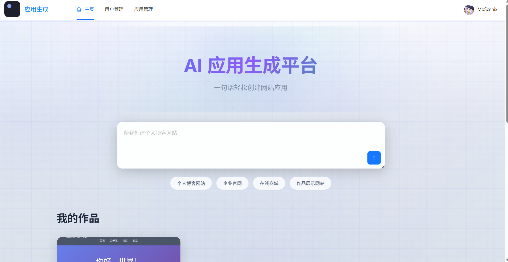

# ai-code

> 基于**Kitex**和**Hertz**的分布式**AI**编程网站

## 概览

+ 基于 Docker，真正一键部署
+ 前后端分离，模块化编程，微服务
+ 权限划分，各级用户权限明确

## 快速开始

参考[快速开始](README/quick-start.md)

## 可观测性&&运维

参考[可观测&&运维](README/observability-and-maintenance.md)

## 技术栈

参考[技术栈](README/stack.md)

## 页面截图

### 主页

